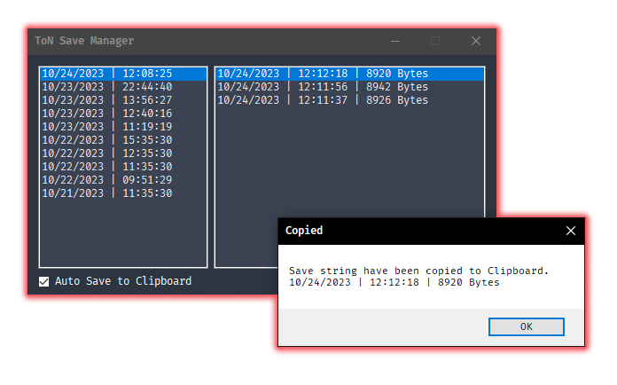

# Terrors of Nowhere: Save Manager

This tool will keep track of your **Save Codes** so you can play and recover your codes later if you forgot to make a backup.

It also stores every **Save Code** found into a local data file called `data.json` to keep a backup of all your previous codes.

### Features
- Automatically scan your logs for previous **Save Codes**.
- While the tool is running, it will detect new codes as you play.
- If the option `Auto Save to Clipboard` is enabled, it will automatically copy new codes to the clipboard as you play (*I got you covered, instance hoppers*)
- Previously detected save codes will be saved to a local database, so if VRChat deletes logs overtime, you'll have a history of Save Codes locally, and safe.
- You can add notes to **Save Codes** by using right-click on the entry in the left panel.
- You can favorite or bookmark save codes into your own collections.
### Limitations
- This is a Windows only tool. (*Sorry Linux users*)
- VRChat will delete old logs over the span of a few days (Like 4 or 5 days) so if the tool wasn't run before the logs got deleted, those saves are gone.

# FAQ:

### How do I use this?
Download the [latest released](https://github.com/ChrisFeline/ToNSaveManager/releases/tag/latest) bundled file called `ToNSaveManager.zip`.

Extract the contents of the .zip file into a folder. Open the executable called `ToNSaveManager.exe` then click on the most recent log date on the left, and try a **Save Code** on the right.

They are ordered by date, so you can find your latest codes much easier.

### Where can I request a feature?
If you want to suggest new features or changes, you can open an Issue here or you can ping me on the official [Toren Discord](https://discord.gg/bus-to-nowhere) as @**Kittenji**

### How does it work?
Initially, the program will monitor your logs at `%LOCALAPPDATA%Low\VRChat\VRChat` and detect previous **Save Codes** in your logs. Then it will continue detecting new codes as you play.

### Why is the .exe so big? >100MB
The exe is bundled with the .NET runtime that it's required to run the program. Using a command line argument for dotnet publishing: `--self-contained true -p:PublishSingleFile=true`

This is so people that download this program does not have to go download the .NET runtime framework themselves. And it's ready to run without any extra actions from the user.

The program is compiled from the source using Github actions, you can see the full arguments in [the workflow file](https://github.com/ChrisFeline/ToNSaveManager/blob/a0d503b02fe25fde1b36ca9807756f1830c8e7a8/.github/workflows/dotnet-desktop.yml#L46C45-L46C45).

### Is this against VRChats ToS?
* No

This is an external tool that uses local plain text files that VRChat writes to the Local APPDATA folder.

It does not modify or alter the game in any way. This is not a mod or a cheat.