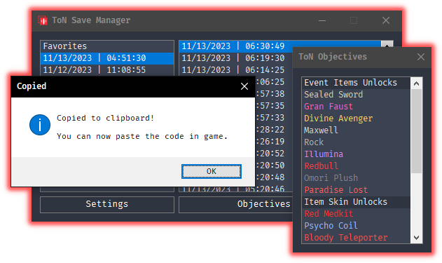
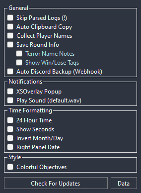
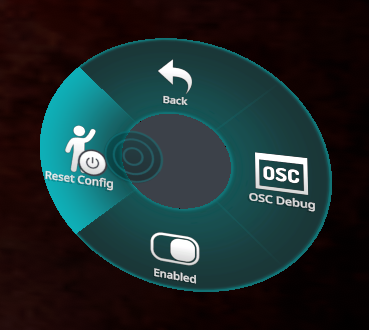
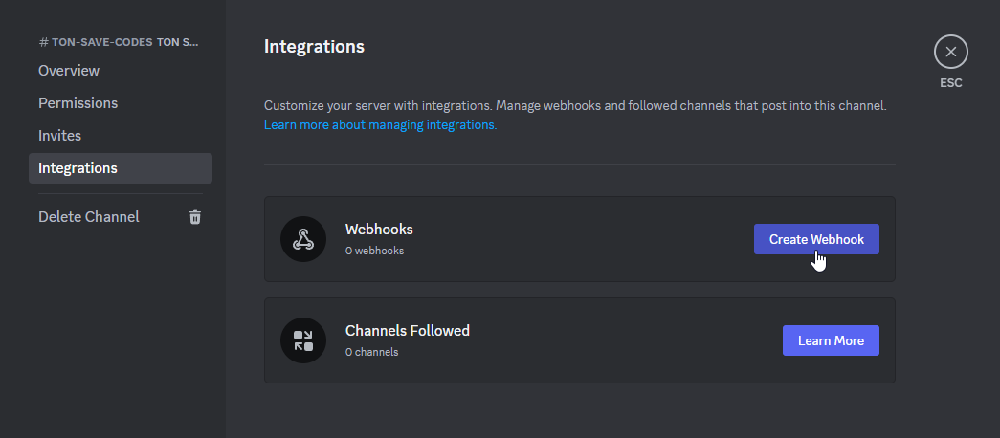
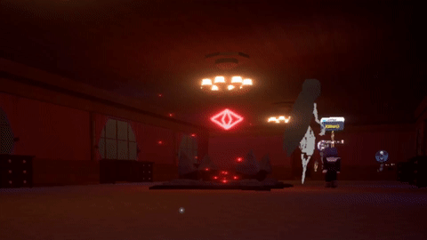



  

  # Terrors of Nowhere: Save Manager
  Simple tool that will keep track of your **Save Codes** so you can play and recover your codes later if you forgot to make a backup.
  And saves your code history locally for later use.

  # [Download](https://github.com/ChrisFeline/ToNSaveManager/releases/latest/download/ToNSaveManager.zip "Use this link to download the latest version directly from GitHub.")

  [View Releases](https://github.com/ChrisFeline/ToNSaveManager/releases "Show a list of current and previous releases.") • 
  [Saving Guide](https://terror.moe/save "HOW TO SAVE & LOAD FOR DUMMIES") • 
  [How To Use](#-faq)

  

# 🛠️ Features & Clarifications
- Automatically scans your logs for previous **Save Codes**.
- While the tool is running, it will detect new codes as you play.
- Previously detected save codes will be saved to a local database, so if VRChat deletes logs overtime, you'll have a history of Save Codes locally, and safe.

## Settings Window
- `Check For Updates` When clicked, it will check this github repo for new releases, and prompt you to try an automatic update.
- `Auto Clipboard Copy` Automatically copy new save codes to clipboard.
- `Collect Player Names` Save codes will show players that were in the instance.
- `XSOverlay Popup` XSOverlay notifications when new save codes are detected.
- `Play Sound` Play a notification audio when a new save is detected.
  - Double Click to select a custom audio file. (Only '.wav' files)
  - Right Click to reset audio file back to 'default.wav'
- `Colorful Objectives` Items in the 'Objectives' window will show colors that correspond to those of the items in the game.
- `Auto Discord Backup` Uses a [discord webhook](#how-to-properly-configure-automatic-discord-backup-using-webhooks) to automatically upload a backup of your new codes to a discord channel as you play.
- `Send OSC Parameters` Sends avatar parameters to VRChat using OSC. Check the [documentation](#osc-documentation) below for more info.
- `WebSocket API Server` Enables a WebSocket server that sends realtime in-game events to the connected clients. Check the [**API Documentation**](Docs/WebSocketAPI.md) for more info.
- `Send Chatbox Message` Sends ToN info to the VRChat chatbox. (Only visible during Intermissions) - To further customize the template read [**Templates Documentation**](Docs/Templates.md) for more info.

Preview Image

  

## Right Click Menus
- ### Log Dates (Left Panel)
  * `Import` You can enter your own code and save it in that collection.
  * `Rename` Lets you rename a collection.
  * `Delete` Deletes the entire log date from the database.
- ### Save Codes (Right Panel)
  * `Add to` Lets you save or favorite this code to a separated custom collection with a name of your choice.
  * `Edit Note` You can attach a note to this save code, so you can recognize it better.
  * `Backup` Forces a backup upload to Discord if **Auto Discord Backup** is configured on settings.
  * `Delete` Deletes just this save code from the database.
  
## Objectives Window
- This window gives you a list of unlockables that you can check to track your progress. Just click on the things you already unlocked.

## OSC Documentation
[**Parameter Names & Types**](Docs/OSC/OSC_Parameters.md)

[**Round Type Values**](Docs/OSC/OSC_RoundType.md)

OSC Troubleshooting

If your parameters are not being received properly... try resetting the OSC config.

You can do this by opening your <b>Radial menu</b>, open <b>OSC</b>, then click <b>Reset Config</b>.

# 🌐 Available Translations
| Language | Translator |
| -------- | ---------- |
| English  | -          |
| Spanish  | -          |
| Japanese | [github.com/nomlasvrc](https://github.com/nomlasvrc)   [twitter.com/nomlasvrc](https://twitter.com/nomlasvrc) |

# 📋 FAQ:

> ## How do I use this?
> 1. Download on the [<u>Latest Release</u>](https://github.com/ChrisFeline/ToNSaveManager/releases/latest), the compressed file called `ToNSaveManager.zip`.
> 2. Extract the contents of the **.zip** file into a folder of your choice.
> 3. Open `ToNSaveManager.exe`.
> 4. Select the log date on the left, then click one of the saves in the right.
> 5. Your code is now in the clipboard, go to VRChat and paste the code in the input field.

> ## Where can I request a feature?
> If you want to suggest new features or changes, you can open an [Issue](https://github.com/ChrisFeline/ToNSaveManager/issues) here or you can ping me on the official [Toren Discord](https://discord.gg/bus-to-nowhere) as @**Kittenji**

> ## How does it work?
> The world periodically saves a snapshot of your progress in the VRChat log files.
> 
> Initially, the program will scan your logs at `%LOCALAPPDATA%Low\VRChat\VRChat` and recover previous **Save Codes** in your logs. Then it will continue detecting new codes as you play.

> ## Why is it not showing anything despite previously playing Terrors?
> There's the possibility that you have **logging** disabled.
> You can enable it by opening your Quick Menu, go to settings, scroll all the way down and turn logging **on**.
> 

> 
<b>Show Image</b>

> 
  

> 

> ## How to properly configure Automatic Discord Backup using Webhooks?
> You can set a Discord webhook url to automatically upload your codes to a discord channel.
>
> - Just go to your preferred channel on your discord server.
> - Click **Edit Channel** and then go to **Integrations**.
> - Add a webhook integration to this channel. *You can give it a name and a profile picture*.
> - Copy the webhook url.
> - Open settings on the Save Manager app.
> - Enable `Auto Discord Backup`, you will see a text input popup.
> - Paste your webhook url in the text field.
> - Click **save**.
> 
> NOTE: If you want to test this functionality, you can right click on a save entry then click **Backup**. If everything is right, save will be uploaded to the discord channel.
> 

> 
<b>Show Discord Screenshots</b>

> 
  

> 
  

> 
  

> 

> ## Why is the .exe so big? >100MB
> The exe is bundled with the .NET runtime that it's required to run the program. Using a command line argument for dotnet publishing: `--self-contained true -p:PublishSingleFile=true`  
> This adds size to the file, but ensures that the program runs independently without relying on a previous .NET installation.
>
> This is so people that download this program does not have to go download the .NET runtime framework themselves. And it's ready to run without any extra actions from the user.
>
> The program is compiled from the source using Github actions, you can see the full arguments in [the workflow file](https://github.com/ChrisFeline/ToNSaveManager/blob/a0d503b02fe25fde1b36ca9807756f1830c8e7a8/.github/workflows/dotnet-desktop.yml#L46C45-L46C45).

> ## Is this against VRChats ToS?
> - **Short Answer:** No
>
> This is an external tool that uses local plain text files that VRChat writes to the Local APPDATA folder.
> We are allowed to read these files since it does not modify or alter the game in any way.
> **This is not a mod or a cheat.**

> ## How to contribute with translations?
> > **NOTE**: You can test your language file as you work by dragging the `.json` file into the **Language** box in the **Settings** window.
> - Fork clone the [localization](https://github.com/ChrisFeline/ToNSaveManager/tree/localization) branch.
> - Create a copy of the `en-US.json` language file into `/Localization/Language`
> - Rename it to your local ISO language name. For example `ja-JP.json`
> - Translate the strings contained within this file into your target language.
> 	* Keep important string replacement tokens like: `{0}`, `{1}` or `$$MAIN.SETTINGS$$` etc...
> - Create a pull request.
> 	* Do **NOT** create a pull request into the `main` branch.
> 	* Make sure the only edited file is the new added language `.json` file, any other contribution in the source code unrelated to this translation will be rejected.
> ### OR
> - Download the file [`en-US.json`](https://github.com/ChrisFeline/ToNSaveManager/blob/main/Localization/Language/en-US.json) from this repo.
> - Rename it to your local ISO language name. For example `ja-JP.json`
> - You can [contact me](#-contact) on discord and I'll review the changes.

> ### Please do <u>NOT</u> message Beyond about suggestions or problems with this tool.
> You can report problems or suggestions under the [Issues](https://github.com/ChrisFeline/ToNSaveManager/issues) tab on this repo. Alternatively see contact information below.

# 📫 Contact:
> - **Discord:** [@Kittenji](https://discord.gg/HGk2RQX) 
> - **VRChat:** [Kittenji](https://vrchat.com/home/user/usr_7ac745b8-e50e-4c9c-95e5-8e7e3bcde682)
> ## Say hi if you see me playing [Terrors of Nowhere](https://vrchat.com/home/world/wrld_a61cdabe-1218-4287-9ffc-2a4d1414e5bd)!
> 
  

# ❤️ Support:
> If you want to support the development of this tool you can [Buy Me A Coffee ♥](https://ko-fi.com/kittenji) on ko-fi.